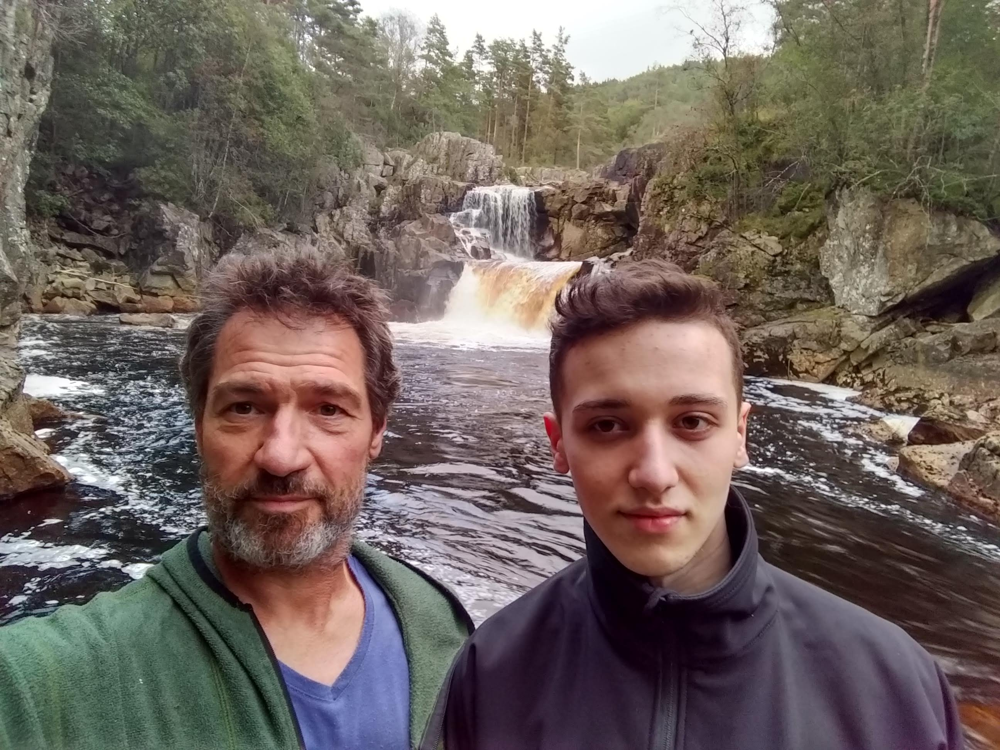

# Markdown blogpost 002 (h1)

## We are getting there! (h2)

This is a beautifull blogpost.

### TODO (h3)

* Add an image
* Use Netlify CMS

And here is our image:
Duhhh

8th try: YAY, a huge image!



7th Try (changed images folder from /src to /blog)
```

TypeError: Cannot read property 'allPost' of null
```
```
6th Try:

Type error again: TypeError: Cannot read property 'allPost' of null
```

```


```


5th Try:
```

Now suddenly the whole blog does not work anymore 8deleted cache and reloaded twice)
TypeError: Cannot read property 'allPost' of null
```


4th Try:
```

marc-en-leon.jpg:1 GET http://localhost:8081/assets/images/marc-en-leon.jpg 404 (Not Found)
```

3rd Try:
```

GET http://localhost:8081/blog/secondblogpost/~/assets/images/marc-en-leon.jpg 404 (Not Found)
```

1st try:
```

"errors": [
    {
      "message": "/var/www/node/gridsomeblog/blog/src/assets/images/marc-en-leon.jpg was not found.",
```


Second try:
``` 

GET http://localhost:8081/blog/secondblogpost/~/src/assets/images/marc-en-leon.jpg 404 (Not Found)
 ```